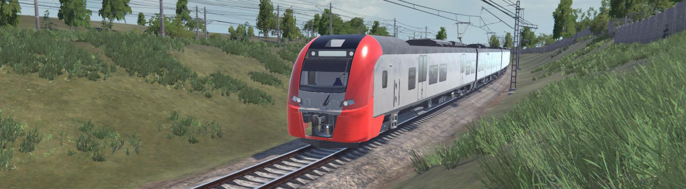
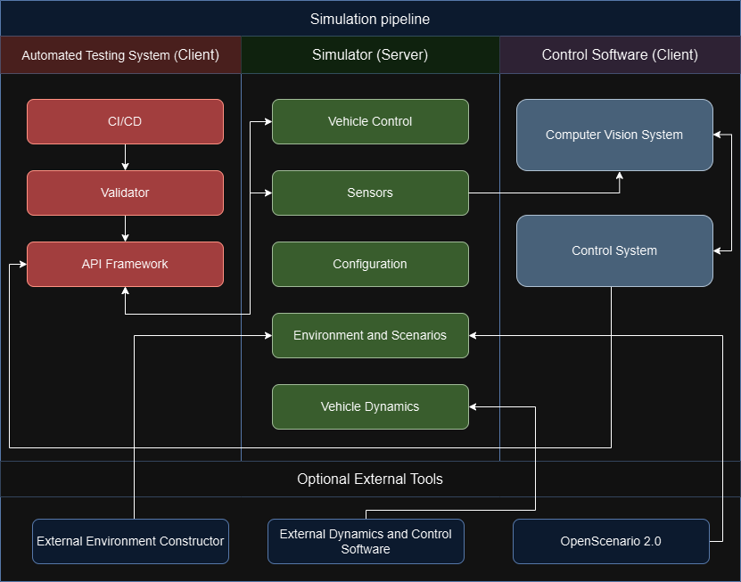
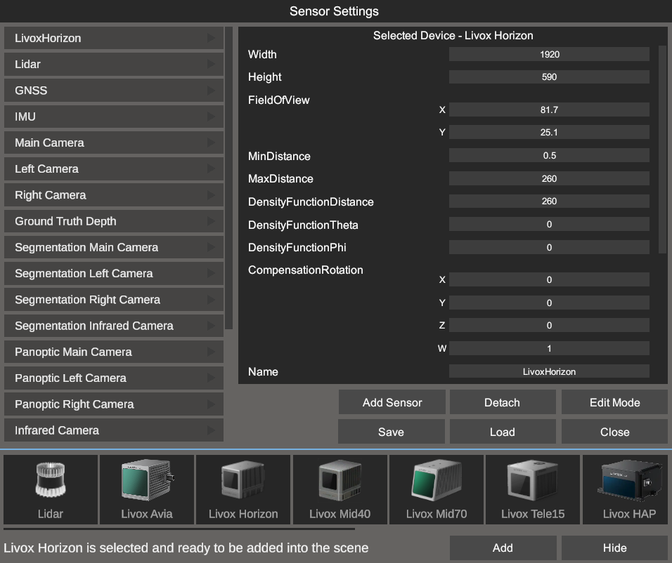

<h1 align="center">InterSense Simulator</h1>

 

  <h4>
   <a href="https://github.com/InterSenseOrg/InterSenseSimulator/releases/latest" style="text-decoration: 
   none">Download Release</a> 
  </h4>

## Introduction
InterSense simulator has been designed for autonomous systems developers. Simulator could be used in development, testing, training and validation processes of autonomous systems in close to real operational conditions. 
It significantly decreases the cost of autonomous systems development process, particularly in tuning and testing of the sensor equipment, control system and interaction with other static and dynamic objects.

## Purpose
Simulator provides the functionality for debugging and modeling the behavior of autonomous systems in real-time and in real 3D environment, which helps to avoid critical design errors, quickly clarify low-level requirements for individual nodes, shift the verification process to earlier stages, carry out more iterations of the prototype research in a short period of time and save on the full-scale tests.

## Data Flow
For the control software and automated testing system clients, TCP connection must be established to transmit the data. The figure below shows the whole simulation pipeline. Since the simulator transmits Protobuf over TCP, in order to deserialize data on the client side, `messages.proto` file must be taken and compiled from the `Proto` [directory](/Proto).

 

## Sensor Simulation
The simulator provides a comprehensive functionality for sensor simulation. It includes the following types - Lidar(Ouster, Velodyne, Livox), Camera, GNSS, IMU, Ground Truth 2D/3D, Ground Truth Railway, Semantic: segmentation, panoptic.
Figure below shows `Sensor Settings` where each sensor parameter can be configured at runtime. User is able to add some ready-to-use sensor models into the scene, configure intrinsic/extrinsic parameters and save it for the later use.

 

## Scenario and Environment Editor
`Environment and Scenario` editor is a complex tool that allows to add custom objects into the scene and to create a huge variety of scenarios for testing EGO vehicle behavior in the different cases.

 

## Automated Testing API

The simulator supports Python API functionality for carrying out 24/7 inifinite tests. It allows to handle scene objects, sensor parameters, environment, vehicle state and etc.

## Foxglove connection and visualization

The InterSense simulator provides a possibility to visualize and debug the flow of sensory data in real time with [Foxglove](https://foxglove.dev/). 

 